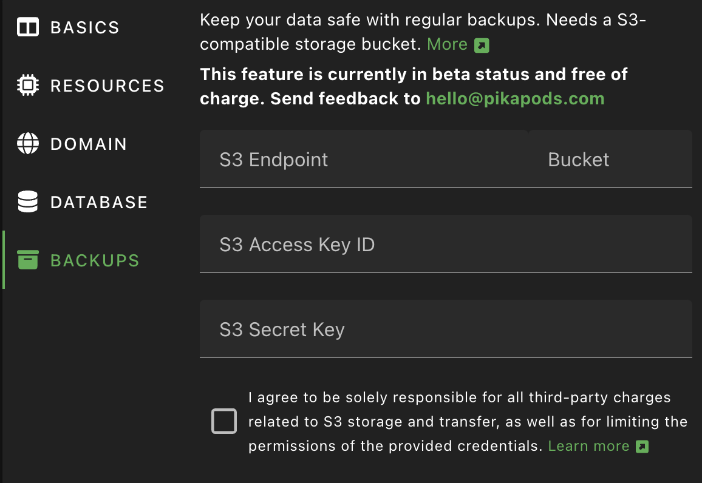

# Backing up Your PikaPods Pods

Keeping your data safe is very important to us. That's why we take measures at multiple levels to ensure no data gets lost. Here the different types of backups available:

## Full Server Backups

We keep daily backups of all databases and mounted files (everything you see over SFTP) pods use. These backups are meant to recover from server-wide failures. While it's also possible to restore individual pod files in emergencies, we currently can't offer this service regularly.

## Manual One-Time Backups

If you just need to grab your data once for a migration, you can follow these manual steps. They let you export your files and related database:

All persistent pod data is available over [SFTP](/manage/files#accessing-pod-files-using-sftp). Some pods also use an external database, usually Postgresql or MySQL/MariaDB.

You can make a full pod backup by following the steps:

1. Enable [SFTP](/manage/files#accessing-pod-files-using-sftp) in the pod's settings.
2. Enable [Database access](/manage/database#accessing-the-pods-database) in the pod's settings.
3. Stop the pod to make sure all data from memory is written to disk (e.g. for SQLite or Mongo databases)
4. Log into the pod via SFTP and copy all files.
5. Log into the pod's database and _Export_ the whole database.
6. Start your pod again


## Incremental Backups to S3

If you keep critical data in your pod and require your own daily backup, then our incremental backups to external S3 storage are the best solution. They can be triggered manually or daily at night and take **incremental, encrypted, deduplicated and compressed snapshots** using [Restic](https://restic.readthedocs.io/en/). This has the benefit that only changed files are copied and the backup doesn't need as much space. You can also provide your own S3-based storage, which moves the data to another company for extra redundancy.


Follow the steps below to set up incremental backups:

### S3 Storage Provider

*PikaPods* doesn't offer backup storage and it's best practice to keep backups with another provider. *S3* is a standardized storage protocol, first introduced by Amazon and now offered by many companies. You can use any one of them. To make the choice easier, here a list of popular choices:

- [**Backblaze B2**](https://www.backblaze.com/cloud-storage): A reliable and established choice priced at $6/TB/month. Some data transfer is included, so unless you download your backup very often, you will only pay for what you use each month. 10 GB are free, which is enough to keep backups of smaller pods.
- [**iDrive e2**](https://www.idrive.com/s3-storage-e2/): A more recent addition, if you are looking for a lower price. You need to commit for a year, but get 50% off the first year and then pay around $4-5/TB/month.
- [**Amazon AWS S3**](https://aws.amazon.com/s3/): The best-known offering, but also the most expensive and more complicated to set up. Can make sense, if you already use other services from AWS.


### *PikaPods* Backup Settings

After signing up with your chosen provider, you can create a "bucket" to hold your data. One bucket can only hold backups for one pod.

After adding a bucket, you can add an API key to access it. Please be sure to limit the key to this one bucket only. How to do this for different providers:

- **Backblaze B2**: Under *Application Keys* choose *Add a New Application Key*, then select the previously created bucket.
- **iDrive e2**: Under *Access Keys* add a new key and pick the region and bucket created before.
- **Amazon AWS S3**: Use the IAM console to create a user, then create a policy allowing full access to the bucket and assign it to the user. Finally, create an *Access Key* for that user.

With your bucket and key all set up, you can now add them in *PikaPods*.

In the final step you enter the bucket hostname (often called endpoint), the bucket name and related access key and password (often called access key secret or similar) on the *PikaPods* control panel. These settings can be found under *Pod Settings > Backups* are separate for each pod, since *one* bucket can only keep backups of *one* pod.

For the endpoint, be sure to use the hostname **without** the bucket name prepended. Some examples and how to find it:

- **Backblaze B2**: `s3.us-west-001.backblazeb2.com`, shown as *Endpoint* under *Buckets*
- **iDrive e2**: `n6j2.fra1.idrivee2-95.com`, shown as *Region endpoint* under *Dashboard*
- **Amazon AWS S3**: Just `s3.amazonaws.com` will work. Or a regional endpoint like `s3.us-east-1.amazonaws.com`, listed [here](https://docs.aws.amazon.com/general/latest/gr/s3.html#auto-endpoints-s3).



After entering and verifying those settings, you can trigger your first backup via *More > Backup*. Depending on the size of the pod's files and database, this can take several minutes. After a successful backup, the date and time will be shown in the pod's overview and in *Pod Settings > Backups*.

### Restore Backups using Restic

Incremental backups use the [Restic](https://restic.readthedocs.io/en/) tool. To verify or restore a pod backup, follow the steps below. Note that this needs some technical expertise, but we are working in integrating the process in the control panel eventually.

First take note of the repository URL and password found in *Pod Settings > Backups*. Then you will also need the access key and secret created with your S3 provider. Those can't be retrieved from *PikaPods* for security reasons, but you could recreate them if needed.

It's easiest to set all those settings as environment variables. For example for S3:


```
export RESTIC_REPOSITORY=s3:https://s3.amazonaws.com/my-pod-backup-1
export RESTIC_PASSWORD=xxxx
export AWS_ACCESS_KEY_ID=xxxx
export AWS_SECRET_ACCESS_KEY=xxxx
```

Then you can list all the snapshots in this bucket. *PikaPods* adds some metadata, like the app name to each. The official [Restic docs](https://restic.readthedocs.io/en/stable/045_working_with_repos.html#listing-all-snapshots) have more details on this.

```
$ restic snapshots
```

After deciding which snapshot to use, you can list its files. Docs on this are [here](https://restic.readthedocs.io/en/stable/045_working_with_repos.html#listing-files-in-a-snapshot). The ID is the snapshot ID from the previous command.

```
$ restic ls XXXXXXX
```

Then to actually [restore](https://restic.readthedocs.io/en/stable/050_restore.html) the whole snapshot:

```
$ restic restore XXXXXXX
```

### Cost and Security

This section has additional steps you can take to secure your backups and S3 storage account.

To avoid unexpected charges from your chosen S3 storage provider in relation to *PikaPods* backups:

- Regularly review the storage usage. If you add a lot of data to a pod, the backup will be larger too.
- Be mindful of outgoing data transfer charges. While traffic is free at *PikaPods*, S3 providers sometimes charge for it. Usually *uploading* data to them is free, but *downloading* it can be expensive. Creating a new backup on *PikaPods* will *download* very little data to the S3 service, but restoring a backup or pruning it can use more.
- Be sure to limit the access of keys you add on *PikaPods* to *one bucket only*. *PikaPods* doesn't need access to your other bucket and doesn't need permission to create buckets. It will only ever write files to the bucket you set up.

To ensure the integrity of your backups:

- Keep the *Repository Password* shown in *Pod Settings > Backups* in a safe place. It's needed to decrypt the backup. Without it, the backup will be useless. We don't keep a copy of this password after a pod was deleted.
- Regularly verify your backups: While *PikaPods* takes every possible measure to ensure usable backups, there could be unexpected failures or edge cases with individual apps that make a backup incomplete. Doing a trial restore of a backup can uncover such issues.


### Additional Providers

The following providers have been reported to work by our users.

#### **[Oracle Cloud Object Storage](https://www.oracle.com/bd/cloud/storage/object-storage/)**

Setup Steps in the OCI Console:
1. Create or identify your Object Storage Bucket
2. Note down your Object Storage Namespace and Bucket Name
3. Generate access keys: Go to *Identity & Security > Users > Your User > Customer Secret Keys*
4. Click *Generate Secret Key* and save both the Access Key and Secret Key pair

Settings to use on *PikaPods*:
- **S3 Endpoint**: `<namespace>.compat.objectstorage.<region>.oraclecloud.com`
  - Example: if your namespace is `abc` and region is `us-1`, use: `abc.compat.objectstorage.us-1.oraclecloud.com`
- **Bucket**: Your OCI bucket name (exactly as shown in OCI Console)
- **S3 Access Key ID**: The Access Key from your generated Customer Secret Key
- **S3 Secret Key**: The Secret Key from your generated Customer Secret Key
