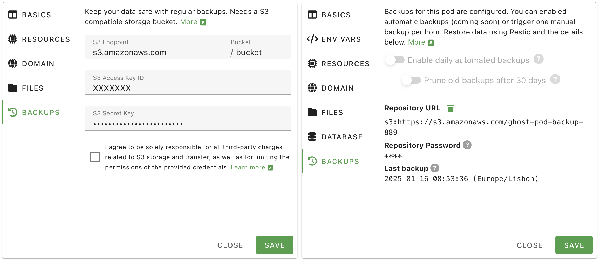
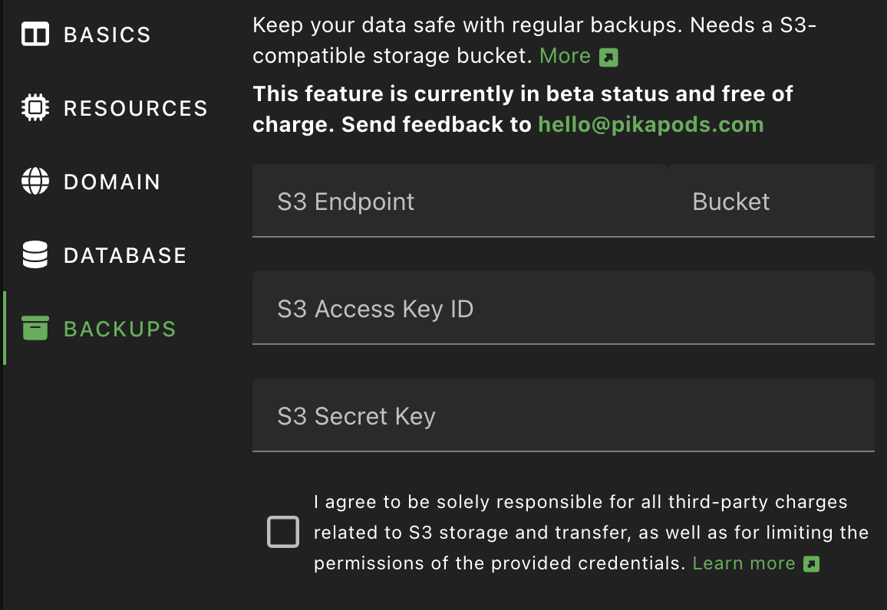

# Backing up Your PikaPods Pods
{: .no_toc }

You own your data at _PikaPods_ — and that includes backing it up. We take measures at multiple levels to reduce the risk of data loss, but no hosting provider can promise your data back. **If the data in your pod is important to you, set up your own backups.** Our [incremental backups to S3](#incremental-backups-to-s3) do this automatically each night, into storage you control and can restore from without us.

Here are the different types of backups available:

1. TOC
{:toc}

## Manual One-Time Backups

If you just need to grab your data once for a migration, you can follow these manual steps. They let you export your files and related database:

All persistent pod data is available over [SFTP](/manage/files#accessing-pod-files-using-sftp). Some pods also use an external database, usually PostgreSQL or MySQL/MariaDB.

You can make a full pod backup by following the steps:

1. Enable [SFTP](/manage/files#accessing-pod-files-using-sftp) in the pod's settings.
2. Enable [Database access](/manage/database#edit-the-pods-database) in the pod's settings.
3. Stop the pod to make sure all data from memory is written to disk (e.g. for SQLite or Mongo databases)
4. Log into the pod via SFTP and copy all files.
5. Log into the pod's database and _Export_ the whole database.
6. Start your pod again

## Incremental Backups to S3

If you keep critical data in your pod and require your own daily backup, then our incremental backups to external S3 storage are the best solution. They can be triggered manually or daily at night and take **incremental, encrypted, deduplicated and compressed snapshots** using [Restic](https://restic.readthedocs.io/en/). This has the benefit that only changed files are copied and the backup doesn't need as much space. You can also provide your own S3-based storage, which moves the data to another company for extra redundancy.



Follow the steps below to set up incremental backups:

### S3 Storage Provider

_PikaPods_ doesn't offer backup storage and it's best practice to keep backups with another provider. _S3_ is a standardized storage protocol, first introduced by Amazon and now offered by many companies. You can use any one of them. To make the choice easier, here are the ones we recommend. The [provider setup reference](#provider-setup-reference) further down has setup details for these and for more providers our users reported to be working.

- [**Backblaze B2**](https://www.backblaze.com/cloud-storage): A reliable and established choice priced at $6/TB/month. Some data transfer is included, so unless you download your backup very often, you will only pay for what you use each month. 10 GB are free, which is enough to keep backups of smaller pods.
- [**iDrive e2**](https://www.idrive.com/s3-storage-e2/): A more recent addition, if you are looking for a lower price. You need to commit for a year, but get 50% off the first year and then pay around $4-5/TB/month.
- [**Amazon AWS S3**](https://aws.amazon.com/s3/): The best-known offering, but also the most expensive and more complicated to set up. Can make sense, if you already use other services from AWS.

### _PikaPods_ Backup Settings

After signing up with your chosen provider, create a "bucket" to hold your data, then create an access key for it. Providers use different names for this, but you always end up with an **access key ID** and a **secret key**. Please be sure to limit the key to this one bucket only. The [provider setup reference](#provider-setup-reference) has the exact steps for each provider. Most providers show the secret key only once, so copy it before closing the dialog.

With your bucket and key set up, you can add them in _PikaPods_ under _Pod Settings > Backups_. Here you enter the bucket hostname (often called endpoint), the bucket name and the related access key ID and secret key. These settings are separate for each pod, since _one_ bucket can only keep backups of _one_ pod.

For the endpoint, be sure to use the hostname **without** the bucket name prepended. Also don't enter `https://`. The [provider setup reference](#provider-setup-reference) lists the endpoint for each provider.



After entering and verifying those settings, you can trigger your first backup via _More > Backup_. Depending on the size of the pod's files and database, this can take several minutes. After a successful backup, the date and time will be shown in the pod's overview and in _Pod Settings > Backups_.

### Save Your Repository Password

With backups configured, _Pod Settings > Backups_ also shows a **Repository URL** and a **Repository Password**. The password encrypts your backup and is the only way to decrypt it again.

{: .warning }

> Copy the _Repository Password_ somewhere safe outside your pod now, ideally into a password manager. Without it your backup can't be decrypted and is useless. We don't keep a copy of this password after a pod was deleted.

### Checking Backup Integrity

We recommend verifying your backups monthly to ensure they're complete and usable. Keep in mind that verification downloads all backup data from S3, which can result in significant charges from your storage provider. For this reason, monthly checks are sufficient.

To verify your backup integrity, follow the [Restic documentation on checking integrity and consistency](https://restic.readthedocs.io/en/stable/045_working_with_repos.html#checking-integrity-and-consistency). If issues are found, you can repair them using the [troubleshooting guide](https://restic.readthedocs.io/en/stable/077_troubleshooting.html).

### Restore Backups using Restic

Incremental backups use the [Restic](https://restic.readthedocs.io/en/) tool. To verify or restore a pod backup, follow the steps below. Note that this needs some technical expertise, but we are working on integrating the process into the control panel eventually.

First take note of the _Repository URL_ and _Repository Password_ found in _Pod Settings > Backups_. Then you will also need the access key ID and secret key created with your S3 provider. Those can't be retrieved from _PikaPods_ for security reasons, but you could recreate them if needed.

It's easiest to set all those settings as environment variables. For example for S3:

```
export RESTIC_REPOSITORY=s3:https://s3.amazonaws.com/my-pod-backup-1
export RESTIC_PASSWORD=xxxx
export AWS_ACCESS_KEY_ID=xxxx
export AWS_SECRET_ACCESS_KEY=xxxx
```

Then you can list all the snapshots in this bucket. _PikaPods_ adds some metadata, like the app name to each. The official [Restic docs](https://restic.readthedocs.io/en/stable/045_working_with_repos.html#listing-all-snapshots) have more details on this.

```
$ restic snapshots
```

After deciding which snapshot to use, you can list its files. Docs on this are [here](https://restic.readthedocs.io/en/stable/045_working_with_repos.html#listing-files-in-a-snapshot). The ID is the snapshot ID from the previous command.

```
$ restic ls XXXXXXX
```

Then to actually [restore](https://restic.readthedocs.io/en/stable/050_restore.html) the whole snapshot:

```
$ restic restore XXXXXXX
```

To restore the data to a new pod:

1. Add new empty pod and enable [database](/manage/database) and [file access](/manage/files).
2. Stop this empty pod. Data in this pod will be removed.
3. In the database, remove all tables and import the SQL dump from the backup.
4. Using SFTP, put back all the files. Remove any existing files in the process.
5. Start the new pod and check the [logs](/manage/debug) for potential errors

Some pods don't use a database or don't use files. In this case those steps can be skipped. You may also need to
adjust env vars. Those aren't contained in the Restic backup.

### Cost and Security

This section has additional steps you can take to secure your backups and S3 storage account.

To avoid unexpected charges from your chosen S3 storage provider in relation to _PikaPods_ backups:

- Regularly review the storage usage. If you add a lot of data to a pod, the backup will be larger too.
- If you enable the setting to prune, old snapshots are automatically pruned. 60 days of snapshots are stored with pruning enabled. At this time, the retention policy is not user-configurable from the control panel.
- Be mindful of outgoing data transfer charges. While traffic is free at _PikaPods_, S3 providers sometimes charge for it. Usually _uploading_ data to them is free, but _downloading_ it can be expensive. Creating a new backup on _PikaPods_ will _download_ very little data to the S3 service, but restoring a backup or pruning it can use more.
- Be sure to limit the access of keys you add on _PikaPods_ to _one bucket only_. _PikaPods_ doesn't need access to your other bucket and doesn't need permission to create buckets. It will only ever write files to the bucket you set up.

To ensure the integrity of your backups:

- Keep your [Repository Password](#save-your-repository-password) somewhere safe. Without it, the backup can't be decrypted and is useless.
- Regularly verify your backups: While _PikaPods_ takes every possible measure to ensure usable backups, there could be unexpected failures or edge cases with individual apps that make a backup incomplete. Doing a trial restore of a backup can uncover such issues.

### Provider Setup Reference

Where to create the access key and secret for each provider, and what to use as the endpoint. The first three are the ones recommended under [S3 Storage Provider](#s3-storage-provider); the rest have been reported to work by our users.

#### **[Backblaze B2](https://www.backblaze.com/cloud-storage)**

- **Access key and secret**: Called an _Application Key_ here. Under _Application Keys_ choose _Add a New Application Key_, then select the previously created bucket.
- **S3 Endpoint**: Shown as _Endpoint_ under _Buckets_, e.g. `s3.us-west-001.backblazeb2.com`

#### **[iDrive e2](https://www.idrive.com/s3-storage-e2/)**

- **Access key and secret**: Under _Access Keys_ add a new key and pick the region and bucket created before.
- **S3 Endpoint**: Shown as _Region endpoint_ under _Dashboard_, e.g. `n6j2.fra1.idrivee2-95.com`

#### **[Amazon AWS S3](https://aws.amazon.com/s3/)**

- **Access key and secret**: Use the IAM console to create a user, then create a policy allowing full access to the bucket and assign it to the user. Finally, create an _Access Key_ for that user.
- **S3 Endpoint**: Just `s3.amazonaws.com` will work. Or a regional endpoint like `s3.us-east-1.amazonaws.com`, listed [here](https://docs.aws.amazon.com/general/latest/gr/s3.html#auto-endpoints-s3).

#### **[Cloudflare R2](https://www.cloudflare.com/developer-platform/products/r2/)**

- **Access key and secret**: Called an _API Token_ here. Under _R2 > Manage R2 API Tokens_ create a token with _Object Read & Write_ permission for your bucket only.
- **S3 Endpoint**: Shown in the R2 bucket settings, e.g. `[account-id].r2.cloudflarestorage.com`

#### **[Oracle Cloud Object Storage](https://www.oracle.com/bd/cloud/storage/object-storage/)**

- **Access key and secret**: Called a _Customer Secret Key_ here. Under _Identity & Security > Users > Your User > Customer Secret Keys_ choose _Generate Secret Key_.
- **S3 Endpoint**: `<namespace>.compat.objectstorage.<region>.oraclecloud.com`, e.g. `abc.compat.objectstorage.us-1.oraclecloud.com`. Your namespace is shown in the bucket details.

#### **[Scaleway Object Storage](https://www.scaleway.com/en/cloud-storage-solutions/)**

- **Access key and secret**: Called an _API Key_ here. Under _Account > API Keys > Generate an API key_, generate one for yourself and be sure to enable _Object Storage_ for it.
- **S3 Endpoint**: `s3.<region>.scw.cloud`, e.g. `s3.fr-par.scw.cloud` for Paris.

#### **[MEGA S4](https://mega.io/objectstorage)**

- **Access key and secret**: Under _Object storage > Keys_ choose _Create key_ and pick _Root user_.
- **S3 Endpoint**: Listed under _Settings > Object storage > Endpoints_, e.g. `s3.eu-central-1.s4.mega.io` (Amsterdam) or `s3.g.s4.mega.io` (global).

## Full Server Backups

Finally, we keep daily backups of all databases and mounted files (everything you see over SFTP) that pods use. These are meant to recover from server-wide failures, so using them to restore a single pod is a last resort — your own backups are always preferable. If you have lost pod data for any reason and are interested in using our full server backups, get in [touch](mailto:support@pikapods.com) and we'll confirm possible recovery points and cost.

{: .warning }

> We don't stop apps during full server backups and thus a small number of apps using their own database (like MongoDB, PostgreSQL, MariaDB and such) may not have a complete backup each time. So this type of backup is only offered on a best-effort basis and not guaranteed.
