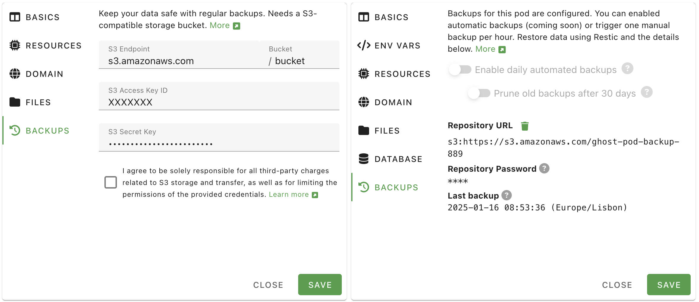

# Backing up Your PikaPods Pods

Keeping your data safe is very important to us. That's why we take measures at multiple levels to ensure no data gets lost. Here the different types of backups available:

## Full Server Backups

We keep daily backups of all databases and mounted files (everything you see over SFTP) pods use. These backups are meant to recover from server-wide failures. Restoring individual pods from them should be a last resort and your own backups are always preferrable. If you have lost pod data for any reason and are interested in using our full server backups, get in [touch](mailto:support@pikapods.com) and we'll confirm possible recovery points and cost.

{: .warning }

> We don't stop apps during full server backups and thus a small number of apps using their own database (like MongoDB, PostgreSQL, MariaDB and such) may not have a complete backup each time. So this type of backup is only offered on a best-effort basis and not guaranteed. For apps with critical data, we strongly recommend setting up your own [incremental backups to S3](#incremental-backups-to-s3) for maximum reliability.

## Manual One-Time Backups

If you just need to grab your data once for a migration, you can follow these manual steps. They let you export your files and related database:

All persistent pod data is available over [SFTP](/manage/files#accessing-pod-files-using-sftp). Some pods also use an external database, usually Postgresql or MySQL/MariaDB.

You can make a full pod backup by following the steps:

1. Enable [SFTP](/manage/files#accessing-pod-files-using-sftp) in the pod's settings.
2. Enable [Database access](/manage/database#accessing-the-pods-database) in the pod's settings.
3. Stop the pod to make sure all data from memory is written to disk (e.g. for SQLite or Mongo databases)
4. Log into the pod via SFTP and copy all files.
5. Log into the pod's database and _Export_ the whole database.
6. Start your pod again

## Incremental Backups to S3

If you keep critical data in your pod and require your own daily backup, then our incremental backups to external S3 storage are the best solution. They can be triggered manually or daily at night and take **incremental, encrypted, deduplicated and compressed snapshots** using [Restic](https://restic.readthedocs.io/en/). This has the benefit that only changed files are copied and the backup doesn't need as much space. You can also provide your own S3-based storage, which moves the data to another company for extra redundancy.



Follow the steps below to set up incremental backups:

### S3 Storage Provider

_PikaPods_ doesn't offer backup storage and it's best practice to keep backups with another provider. _S3_ is a standardized storage protocol, first introduced by Amazon and now offered by many companies. You can use any one of them. To make the choice easier, here a list of popular choices. For even more options, also see the [providers our users reported to be working](#additional-providers) further down.

- [**Backblaze B2**](https://www.backblaze.com/cloud-storage): A reliable and established choice priced at $6/TB/month. Some data transfer is included, so unless you download your backup very often, you will only pay for what you use each month. 10 GB are free, which is enough to keep backups of smaller pods.
- [**iDrive e2**](https://www.idrive.com/s3-storage-e2/): A more recent addition, if you are looking for a lower price. You need to commit for a year, but get 50% off the first year and then pay around $4-5/TB/month.
- [**Amazon AWS S3**](https://aws.amazon.com/s3/): The best-known offering, but also the most expensive and more complicated to set up. Can make sense, if you already use other services from AWS.

### _PikaPods_ Backup Settings

After signing up with your chosen provider, you can create a "bucket" to hold your data. One bucket can only hold backups for one pod.

After adding a bucket, you can add an API key to access it. Please be sure to limit the key to this one bucket only. How to do this for different providers:

- **Backblaze B2**: Under _Application Keys_ choose _Add a New Application Key_, then select the previously created bucket.
- **iDrive e2**: Under _Access Keys_ add a new key and pick the region and bucket created before.
- **Amazon AWS S3**: Use the IAM console to create a user, then create a policy allowing full access to the bucket and assign it to the user. Finally, create an _Access Key_ for that user.

With your bucket and key all set up, you can now add them in _PikaPods_.

In the final step you enter the bucket hostname (often called endpoint), the bucket name and related access key and password (often called access key secret or similar) on the _PikaPods_ control panel. These settings can be found under _Pod Settings > Backups_ are separate for each pod, since _one_ bucket can only keep backups of _one_ pod.

For the endpoint, be sure to use the hostname **without** the bucket name prepended. Also don't enter `https://`. Some examples and how to find it:

- **Backblaze B2**: Shown as _Endpoint_ under _Buckets_, e.g. `s3.us-west-001.backblazeb2.com`
- **iDrive e2**: Shown as _Region endpoint_ under _Dashboard_, e.g. `n6j2.fra1.idrivee2-95.com`
- **Amazon AWS S3**: Just `s3.amazonaws.com` will work. Or a regional endpoint like `s3.us-east-1.amazonaws.com`, listed [here](https://docs.aws.amazon.com/general/latest/gr/s3.html#auto-endpoints-s3).


After entering and verifying those settings, you can trigger your first backup via _More > Backup_. Depending on the size of the pod's files and database, this can take several minutes. After a successful backup, the date and time will be shown in the pod's overview and in _Pod Settings > Backups_.

### Checking Backup Integrity

We recommend verifying your backups monthly to ensure they're complete and usable. Keep in mind that verification downloads all backup data from S3, which can result in significant charges from your storage provider. For this reason, monthly checks are sufficient.

To verify your backup integrity, follow the [Restic documentation on checking integrity and consistency](https://restic.readthedocs.io/en/stable/045_working_with_repos.html#checking-integrity-and-consistency). If issues are found, you can repair them using the [troubleshooting guide](https://restic.readthedocs.io/en/stable/077_troubleshooting.html).

### Restore Backups using Restic

Incremental backups use the [Restic](https://restic.readthedocs.io/en/) tool. To verify or restore a pod backup, follow the steps below. Note that this needs some technical expertise, but we are working in integrating the process in the control panel eventually.

First take note of the repository URL and password found in _Pod Settings > Backups_. Then you will also need the access key and secret created with your S3 provider. Those can't be retrieved from _PikaPods_ for security reasons, but you could recreate them if needed.

It's easiest to set all those settings as environment variables. For example for S3:

```
export RESTIC_REPOSITORY=s3:https://s3.amazonaws.com/my-pod-backup-1
export RESTIC_PASSWORD=xxxx
export AWS_ACCESS_KEY_ID=xxxx
export AWS_SECRET_ACCESS_KEY=xxxx
```

Then you can list all the snapshots in this bucket. _PikaPods_ adds some metadata, like the app name to each. The official [Restic docs](https://restic.readthedocs.io/en/stable/045_working_with_repos.html#listing-all-snapshots) have more details on this.

```
$ restic snapshots
```

After deciding which snapshot to use, you can list its files. Docs on this are [here](https://restic.readthedocs.io/en/stable/045_working_with_repos.html#listing-files-in-a-snapshot). The ID is the snapshot ID from the previous command.

```
$ restic ls XXXXXXX
```

Then to actually [restore](https://restic.readthedocs.io/en/stable/050_restore.html) the whole snapshot:

```
$ restic restore XXXXXXX
```

### Cost and Security

This section has additional steps you can take to secure your backups and S3 storage account.

To avoid unexpected charges from your chosen S3 storage provider in relation to _PikaPods_ backups:

- Regularly review the storage usage. If you add a lot of data to a pod, the backup will be larger too.
- Be mindful of outgoing data transfer charges. While traffic is free at _PikaPods_, S3 providers sometimes charge for it. Usually _uploading_ data to them is free, but _downloading_ it can be expensive. Creating a new backup on _PikaPods_ will _download_ very little data to the S3 service, but restoring a backup or pruning it can use more.
- Be sure to limit the access of keys you add on _PikaPods_ to _one bucket only_. _PikaPods_ doesn't need access to your other bucket and doesn't need permission to create buckets. It will only ever write files to the bucket you set up.

To ensure the integrity of your backups:

- Keep the _Repository Password_ shown in _Pod Settings > Backups_ in a safe place. It's needed to decrypt the backup. Without it, the backup will be useless. We don't keep a copy of this password after a pod was deleted.
- Regularly verify your backups: While _PikaPods_ takes every possible measure to ensure usable backups, there could be unexpected failures or edge cases with individual apps that make a backup incomplete. Doing a trial restore of a backup can uncover such issues.

### Additional Providers

The following providers have been reported to work by our users.

#### **[Cloudflare R2](https://www.cloudflare.com/developer-platform/products/r2/)**

A cost-effective S3-compatible storage with no egress fees. Includes 10GB storage and unlimited bandwidth in the free tier.

Setup Steps in Cloudflare Dashboard:

1. Go to R2 from the left sidebar
2. Create a new bucket for your backups
3. Generate API Token:
   - Click "Manage R2 API Tokens"
   - Create a new API token
   - Give it "Object Read & Write" permissions for your bucket only
   - Save both the Access Key ID and Secret Access Key

Settings to use on _PikaPods_:

- **S3 Endpoint**: `[account-id].r2.cloudflarestorage.com`
  - Find your endpoint in R2 bucket settings
- **Bucket**: Your R2 bucket name
- **S3 Access Key ID**: Access Key ID from your API token
- **S3 Secret Key**: Secret Access Key from your API token

#### **[Oracle Cloud Object Storage](https://www.oracle.com/bd/cloud/storage/object-storage/)**

Setup Steps in the OCI Console:

1. Create or identify your Object Storage Bucket
2. Note down your Object Storage Namespace and Bucket Name
3. Generate access keys: Go to _Identity & Security > Users > Your User > Customer Secret Keys_
4. Click _Generate Secret Key_ and save both the Access Key and Secret Key pair

Settings to use on _PikaPods_:

- **S3 Endpoint**: `<namespace>.compat.objectstorage.<region>.oraclecloud.com`
  - Example: if your namespace is `abc` and region is `us-1`, use: `abc.compat.objectstorage.us-1.oraclecloud.com`
- **Bucket**: Your OCI bucket name (exactly as shown in OCI Console)
- **S3 Access Key ID**: The Access Key from your generated Customer Secret Key
- **S3 Secret Key**: The Secret Key from your generated Customer Secret Key

#### **[Scaleway Object Storage](https://www.scaleway.com/en/cloud-storage-solutions/)**

A European S3-compatible storage solution with multiple region options and flexible pricing, including Glacier storage for backups.

Setup Steps in Scaleway Console:

1. Create your Object Storage Bucket:
   - Choose a region: Paris, Amsterdam, or Warsaw
   - Choose use case: Backup & Archiving
   - Set your bucket name (e.g., pikapod-backup)
2. Generate API Keys:
   - Go to _Account > API Keys > Generate an API key_
   - Select "Generate for myself (IAM user)"
   - Enable Object Storage and set your preferred Project
   - Save both the Access Key ID and Secret Key

Settings to use on _PikaPods_:

- **S3 Endpoint**: `s3.<region>.scw.cloud`
  - Example: for Paris region use `s3.fr-par.scw.cloud`
  - Note: Do NOT include bucket name in the endpoint
- **Bucket**: Your bucket name (found under Bucket Settings > Bucket ID)
- **S3 Access Key ID**: The Access Key ID from your generated API key
- **S3 Secret Key**: The Secret Key from your generated API key

#### **[Tebi S3](https://tebi.io/)**

A European S3-compatible storage solution (based in Cyprus) with a generous free tier offering 50 GB total storage (25 GB of data in 2 copies). Offers unlimited pay-as-you-go plans with no credit card needed to get started. Includes 250 GB of free outbound transfer.

Setup Steps in Tebi:

1. Create an account and set up a bucket for your backups
2. Generate access keys for your bucket
3. Save both the Access Key ID and Secret Key

Settings to use on _PikaPods_:

- **S3 Endpoint**: `s3.tebi.io`
- **Bucket**: Your bucket name
- **S3 Access Key ID**: The Access Key ID from your generated key
- **S3 Secret Key**: The Secret Key from your generated key
