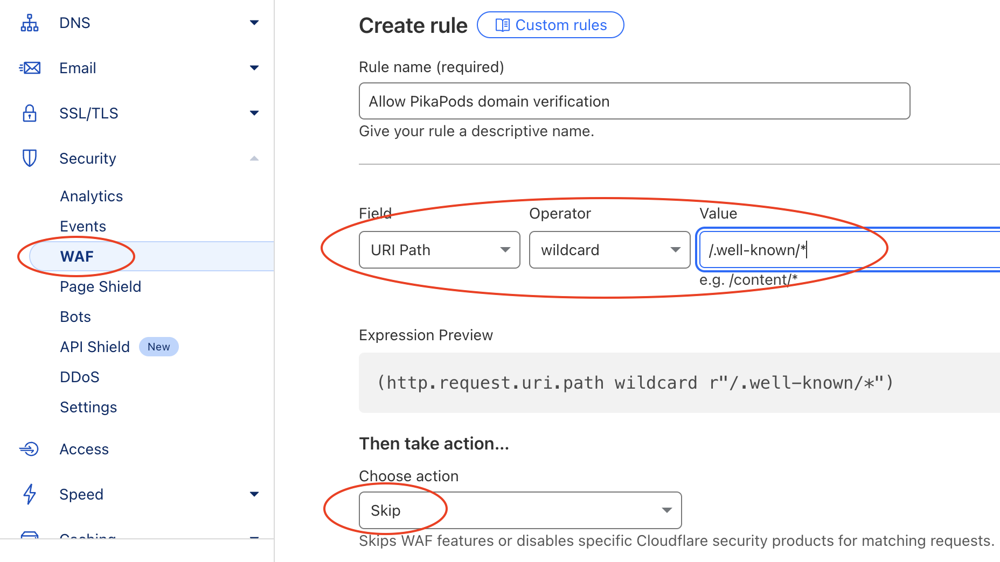

# Custom Domains

## Introduction

Using a custom domain with your pod, allows you to make it available under your own name and brand. Like `blog.joedoe.com`. This is a great way to make it consistent with other websites and email. If you already own a domain, you can use it with your pod in an instant. So it will be reachable as e.g. `status.my-domain.com` or `my-domain.com`.

If you don't have a domain yet, it's also easy to register one. [Domaintyper](https://domaintyper.com/) is a good starting point to find available domains. To compare prices, we like [TLDes](https://tldes.com/cheapest-domains) (no affiliation). See the below video to see the full process from buying a domain to setting it up with _PikaPods_.

<iframe class="youtube-video" src="https://www.youtube-nocookie.com/embed/AvKZ2J_GChA?si=NQmU66FQ0fkD4HIA" title="YouTube video player" frameborder="0" allow="accelerometer; autoplay; clipboard-write; encrypted-media; gyroscope; picture-in-picture; web-share" allowfullscreen></iframe>

## Using Custom Domains

To use your own domain, you need to add a `CNAME` or `ALIAS` record and set your pod's `pikapod.net` domain as target.

> We will also apply for a free SSL certificate for each mapped domain. This ensures all data going to your pod is encrypted. It can take a few minutes before the pod is reachable from the new domain. You may see an error before this.

Steps to use a custom domain:

1. Open _Pod Settings_ and then the _Domain_ tab.
2. Enable _Custom Domain_. Take note of your pod's `xxx-yyy.pikapod.net` subdomain
3. Ensure no CAA records are set that may prevent us from applying for a SSL certificate. If you already use CAA, please also add `sectigo.com`, as mentioned [here](https://help.zerossl.com/hc/en-us/articles/360060119753-Invalid-CAA-Records) **and** `letsencrypt.org` as mentioned [here](https://letsencrypt.org/docs/caa/).
4. Then, depending on if you want to map a subdomain (e.g. `status.my-domain.com`) or root (apex) domain (e.g. `my-domain.com`):

   `CNAME` record for subdomains: `status.my-domain.com. 3600 IN CNAME xxx-yyy.pikapod.net`

   `ALIAS` record for root domains: `@ 3600 IN ALIAS xxx-yyy.pikapod.net`

5. Use a tool like [DNS Checker](https://dnschecker.org/) to ensure the record on your domains shows your `pikapod.net` domain or the same IP.
6. Finally, add the new domain on PikaPod's control panel. If the setup is correct, it will be verified and saved.

After adding a domain, we will periodically check if DNS is still set up correctly. If there is any issue you will receive a notification.

Only **one custom domain** can be mapped per pod. If you need additional alias domains, you will need to set up redirects with your DNS provider or a service like [Freedirector](https://freedirector.io/lite) (free, no signup needed) or [redirect.pizza](https://redirect.pizza/) (free tier). When using Cloudflare, you can also use redirect rules, as described in [this blog post](https://www.timcheadle.com/hosting-ghost-on-pikapods-and-cloudflare/).

## Cloudflare

You can use Cloudflare as domain registrar and use their DNS feature with PikaPods without any additional steps.  [This blog post](https://www.timcheadle.com/hosting-ghost-on-pikapods-and-cloudflare/) describes the steps of setting up a PikaPods pod with CloudFlare.

Using Cloudflare's proxy feature with a _PikaPods_ pod can be beneficial for pods that receive a high volume of external traffic. However, it can slow down performance for private pods that are primarily accessed by logged-in users. Additionally, this setup exposes your unencrypted traffic entirely to Cloudflare, which may raise privacy concerns.

Even if you decide to use Cloudflare, _PikaPods_ still needs to issue a SSL certificate for your domain. To make this process more reliable, please add an exception for the path `/.well-known/*` in _Security > WAF_ and choose to _Skip_ any firewall actions to this path:

### Common Issues with Cloudflare

**Enabling proxy feature**: When first adding a custom domain via Cloudflare, ensure the _Proxy_ feature is **disabled**. Else we can't verify the DNS settings of your domain. You can enable proxying again after adding the custom domain.

**Web application firewall (WAF)**: If you use Cloudflare's proxy feature, it's possible that our monitoring will get blocked and we can no longer determine if your pod is available on its custom domain and we can't renew the encryption certificate for you custom domain. In this case please ensure you have an exception added for the path `/.well-known/*` in _Security > WAF_, as desribed above.

**Origin SSL Setting**: Also ensure that you activate [**Full SSL encryption**](https://developers.cloudflare.com/ssl/origin-configuration/ssl-modes/#available-encryption-modes) (by default, it is set to Flexible SSL, which will cause an infinite loop) or disable the proxy and switch to DNS-only mode.

