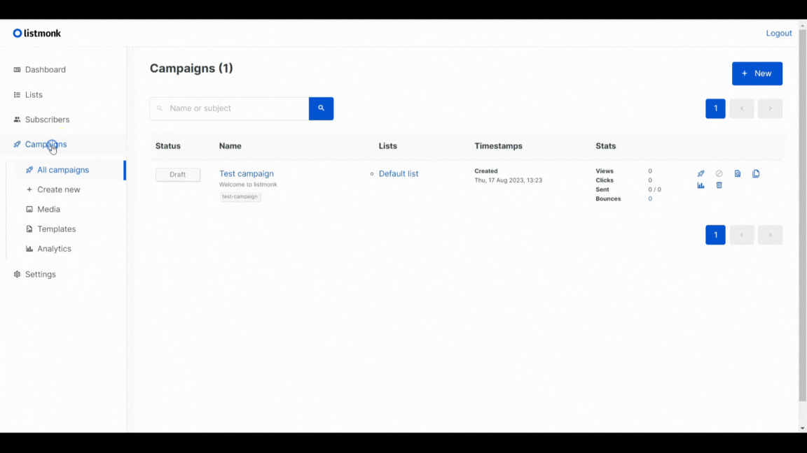
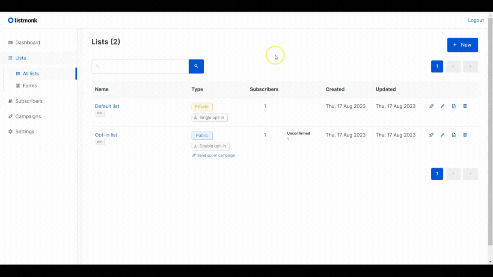

# Listmonk Basics

Learn the fundamental aspects of using Listmonk to manage email campaigns, subscribers, and more.

_[Watch the video tutorial](https://www.youtube.com/watch?v=Myq8MqT9xfM) for a visual demonstration._

Explore the [official Listmonk documentation](https://listmonk.app/docs/) for detailed information.

## Setting Up Listmonk

Listmonk provides a self-hosted solution for managing email lists and campaigns. Follow these steps to set up your Listmonk environment:

1. Install Listmonk on your server.
2. Configure the necessary settings, such as database connections and SMTP configurations.
3. Access the Listmonk admin interface.

## Creating Your First Campaign

With Listmonk, you can easily create and send email campaigns to your subscribers. Here's how to create your first campaign:

1. Navigate to the "Campaigns" section in the Listmonk admin interface.
2. Click on the "Create New" button.
3. Fill in the campaign details, including the name, subject line, and sender information.
4. Select the email list you want to send the campaign to.
5. Choose a template for your email.
6. Write the email content and preview it before sending.
7. Start the campaign and track its performance.

## Managing Subscriber Lists

Listmonk allows you to organize your subscribers into different lists. Here's how to manage your subscriber lists:

1. Access the "Lists" section in the admin interface.
2. Create a new list and define its name and properties.
3. Choose between single and double opt-in options.
4. Set tags and descriptions to categorize your lists.

Start mastering Listmonk's basics to elevate your email marketing strategies and effectively engage with your subscribers.

Continue your exploration of Listmonk's features to unlock even more advanced capabilities for your email campaigns.
