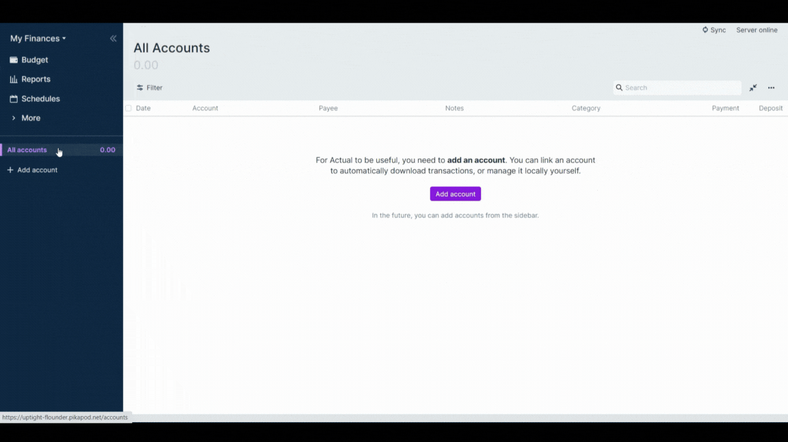
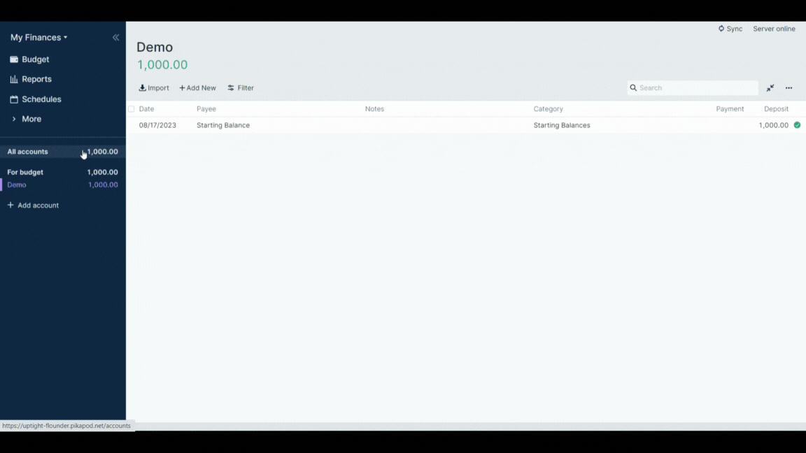
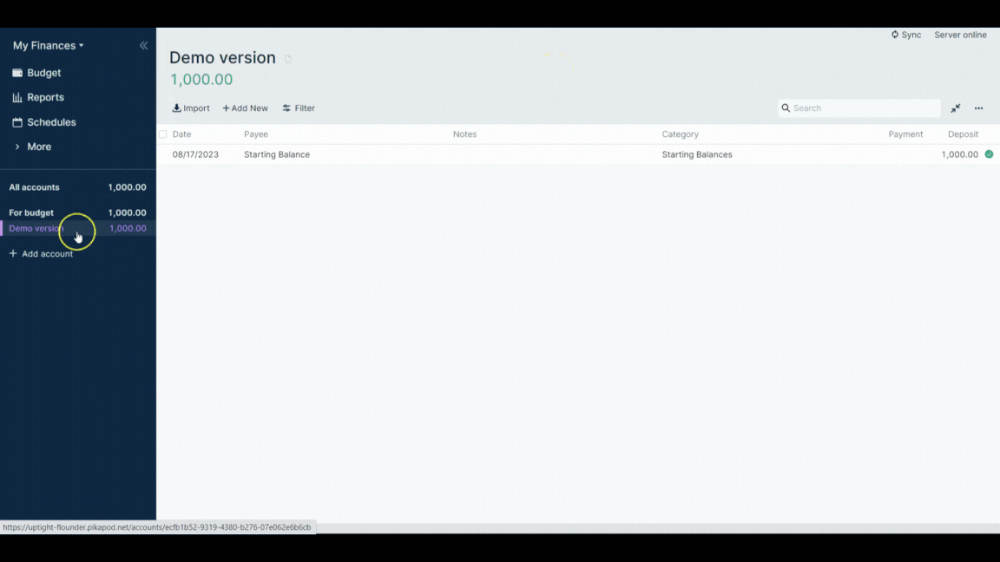
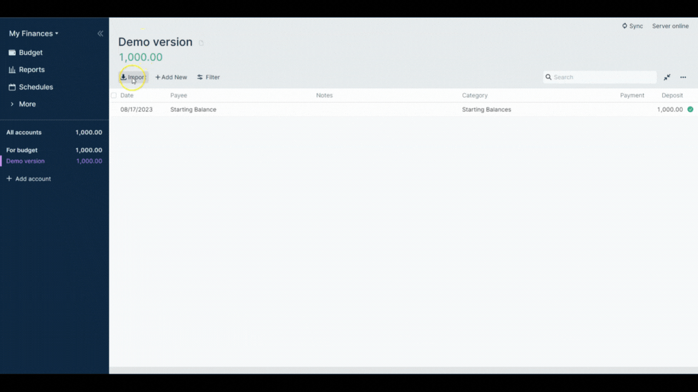
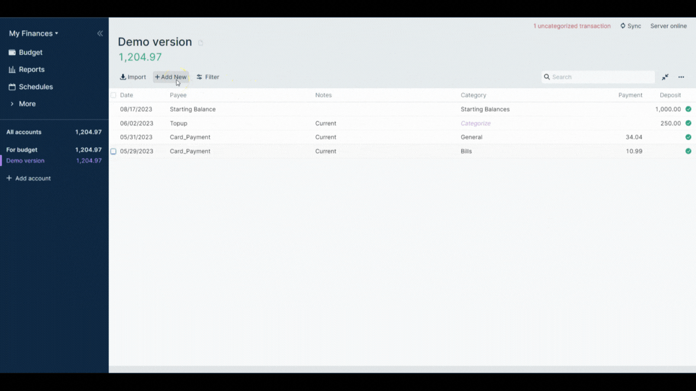

# How to Use Actual App?

**Actual** is a super fast and privacy-focused app for managing your finances. A beautifully designed interface is fine-tuned to get out of your way and make it as fast as possible to explore your finances.

In this guide, we will show you how you can create an account, how you can import files and transactions, and how you can edit transactions.

_[Watch the video tutorial](https://www.youtube.com/watch?v=mdvqzI_SfpQ) for a visual demonstration._

Explore the [official documentation](https://actualbudget.org/docs/) for detailed information.

# How to create an account?

You can create multiple accounts in **Actual**. It can be either off-budget or on-budget. **_Off budget_** accounts don't effect the budget and are meant to track stuff like investments and mortgages. Transactions in off budget accounts can't be categorized; they simply track balances over time.

**_For budget_** accounts affect the budget, and transactions can be categorized. These are accounts where you want to track cash flow and use the budget, like checking accounts and credit cards.

Here is how you can create a local account:

- Click on ‘**all accounts**’ on the left side menu.
- Click on ‘**+ sign**’ or click on ‘**add account**’ on the main dashboard.
- Click on ‘**create local account**’.
- Optional: **toggle off-budget**
- **Give a name** to your account.
- Set a **budget amount**.

# How to change account name?

If you don’t like the name of your account, you can always rename it. Here are the steps:

- Click the **account name** on the sidebar menu.
- **Hover your cursor** close to the account name at the top.
- Click on **pencil icon**.
- **Rename** the account.
- Click on **Enter** to save your changes.

# How to close or delete an account in Actual?

You can also close or delete an account in Actual. However, you would need to have some other account open in order to transfer your remaining balance.

- **Navigate to your account** by clicking on it in the sidebar.
- Click on the **3 dots** (top right of the transactions list) to show the actions menu.
- Select **Close Account**.
- You need to s**elect another account** to transfer the existing balance to. Choose the account that you want your funds moved to.
- Press **Close Account**.

# How to import files?

You can easily import all your bank files into Actual. The app will immediately classify your transactions. Actual app supports importing **_QIF, QFX files, and CSV files_**.

Here is how to import transactions from CSV file:

- **Select the account** where you want to import your transactions.
- Click on **‘import**’ button at the top menu, below your account name.
- **Select the file** on your computer that you want to import.
- You can optionally toggle on “**Split amount into separate inflow/outflow columns**” if your CSV file has separate columns for inflow and outflow amounts (also known as debit and credit).
- If the date is not being imported correctly (the green date is how Actual interprets the date), you can **change the date format** to match your CSV file.
- You can optionally toggle on “**Flip amount**” if you want to negate all of the amounts in the CSV file.
- You can toggle on “Add Multiplier” to add a multiplier to all of the amounts in the CSV file.
- Click on ‘**import’**.
- Change the ‘**payee**’ name by double-clicking on the name.
- **Pick the category** from the dropdown menu.

# How to add transactions manually?

Transactions can be added manually, and you can choose specific date for each transaction. Here are the steps:

- Click on ‘**add transaction**’ at the top menu to add more transaction.
- **Select the date** by clicking on the calendar.
- Write the name in the ‘**payee**’ section.
- Depending on if the transaction is inflow or outflow, **choose debit/credit column** accordingly.
- **Write the amount** for the transaction.
