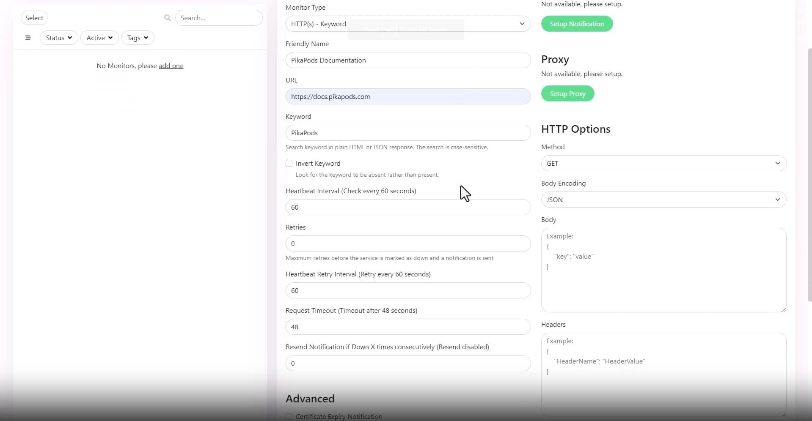
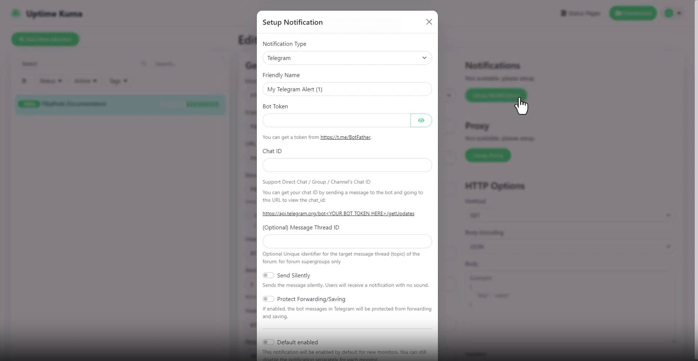

# Setting Up Uptime Kuma on Pikapods

In today's tutorial, we explore setting up a pod, creating an account, adding a monitor, and utilizing status pages with [Uptime Kuma](https://uptime.kuma.pet) which is an open-source application for monitoring website performance and availability.

_[Watch the video tutorial](https://www.youtube.com/watch?v=gbbcnNKPi8M) for a visual demonstration._

## Getting Started

Ensure you're logged into your PikaPods account. New users can register and receive $5 in free credit. [Login here](https://www.pikapods.com/login).

### Step 1: Set up Pod

- **Choose Uptime Kuma** as your Pod.
- **Name your Pod** (e.g., "my website monitoring").
- **Select a region** for hosting (EU or US).

### Step 2: Set Up Uptime Kuma

- **Open your Pod** to access Uptime Kuma.
- **Add a new account** with a username and password to reach the dashboard.

### Step 3: Add Your First Monitor

- Click **Add New Monitor**.
- **Select Monitor Type**: Ping or Keyword.
- **Name Your Monitor** (e.g., "PikaPods Documentation").
- **Add URL** to monitor.

### Step 4: Configuring Notifications

- Go to **Settings > Notifications** to set up.
- **Select Notification Type** and configure.
- **Save** the new notification channel.

### Step 5: Add New Status Page

- Access **'Status Pages'** and click **'Add New Status Page'**.
- **Define the name** and **assign a slug**.
- **Select the Monitor** to display.

Congratulations on setting up Uptime Kuma with PikaPods!
