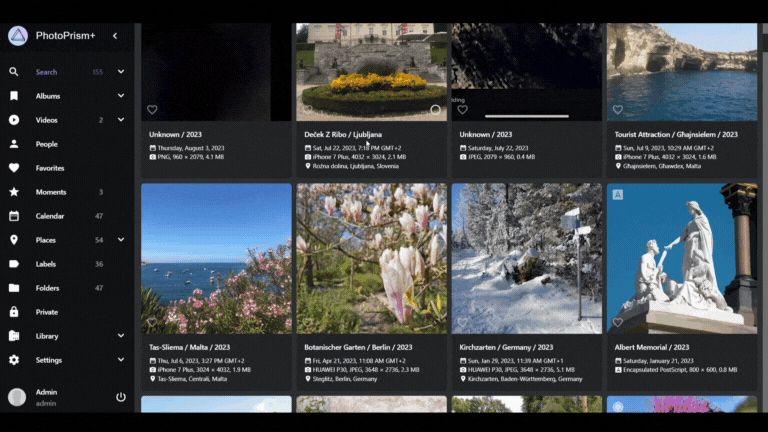
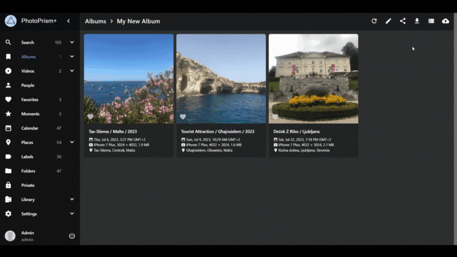
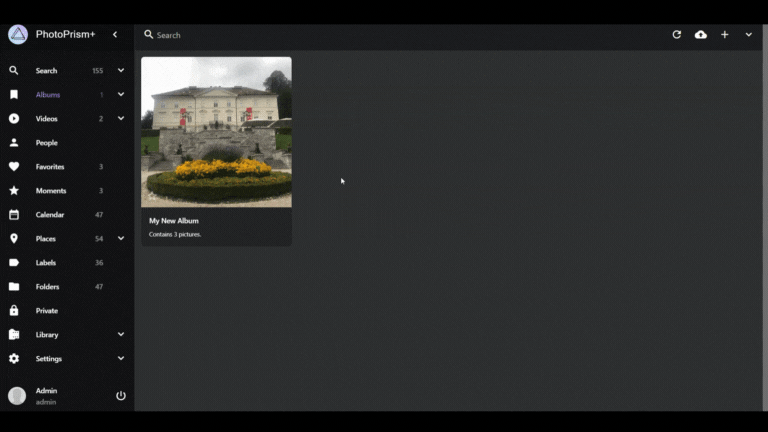

# Using Basic Features of PhotoPrism

Discover how to effectively use the basic features of PhotoPrism to enhance your photo management experience. This guide will walk you through searching for photos, uploading and editing images, creating albums, and sharing your content.

_[Watch the video tutorial](https://www.youtube.com/watch?v=t4w7vQX75mg) for a visual demonstration._

Explore the [official PhotoPrism documentation](https://docs.photoprism.app/) for comprehensive details.

## Searching for Photos

<video controls loop muted preload="none" src="1-search-photos.mp4" poster="1-search-photos.webp"></video>

PhotoPrism offers various filtering options and a user-friendly search bar to help you locate your photos effortlessly. Your images are automatically labeled with details such as date, size, location, and camera settings. Here's how to search for photos:

1. Use the **search bar** to find images based on criteria like people or locations.
2. Explore the **menu** on the left to access different filtering and category options.
3. Employ the **filter in the upper menu** to refine your search by attributes like country, camera settings, year, month, and colors.

## Uploading and Editing Photos

Uploading and editing photos in PhotoPrism is a breeze. The app automatically categorizes new images into the general search category, complete with titles, locations, dates, and camera settings. Follow these steps for uploading and editing photos:

1. Click the **cloud icon** in the upper menu on the far right to begin uploading.
2. Find your uploaded photos in the **general library search category** on the left.
3. Click on a photo to access editing options.
4. Use the **pen icon** in the upper menu to edit the title and description.
5. Once editing is complete, click **Apply** or **Done** at the bottom of the screen.

## Creating and Managing Albums

Organize your photos with ease by creating multiple albums in PhotoPrism. Follow these steps to create a new album and add photos:

1. Access the **albums** section from the left menu.
2. Click the **plus sign** in the upper right corner to create a new album.
3. Edit album details like name, location, description, category, and sorting settings.
4. In the unsorted library, **select photos** for your album.
5. Click the **circle** at the bottom right of the screen.
6. Use the **yellow icon** to add selected photos to your album.
7. In the pop-up, choose your album and click **add to album**.

## Sharing Your Albums

Learn how to share your albums with ease using PhotoPrism. You can even set expiration dates for your shared links. There are two methods to share albums:

### Share from Within an Album:

1. Click the **share icon** at the top right next to the album name.
2. Edit the **shareable link** options in the pop-up.
3. Copy the **shareable link** to the clipboard.

### Share from the 'Albums' Category:

1. **Select the album** you want to share.
2. Click the **circle** at the bottom right.
3. Use the **purple icon** from the options.
4. Edit the **shareable link** options in the pop-up.
5. Copy the **shareable link** to the clipboard.
